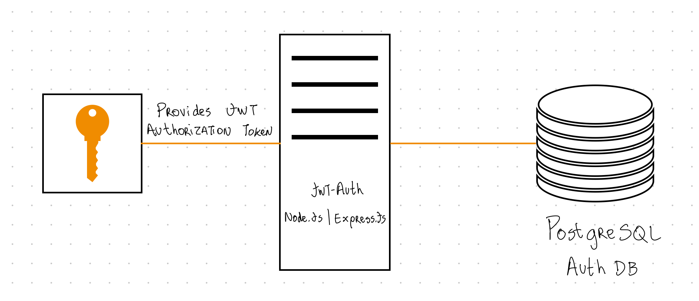
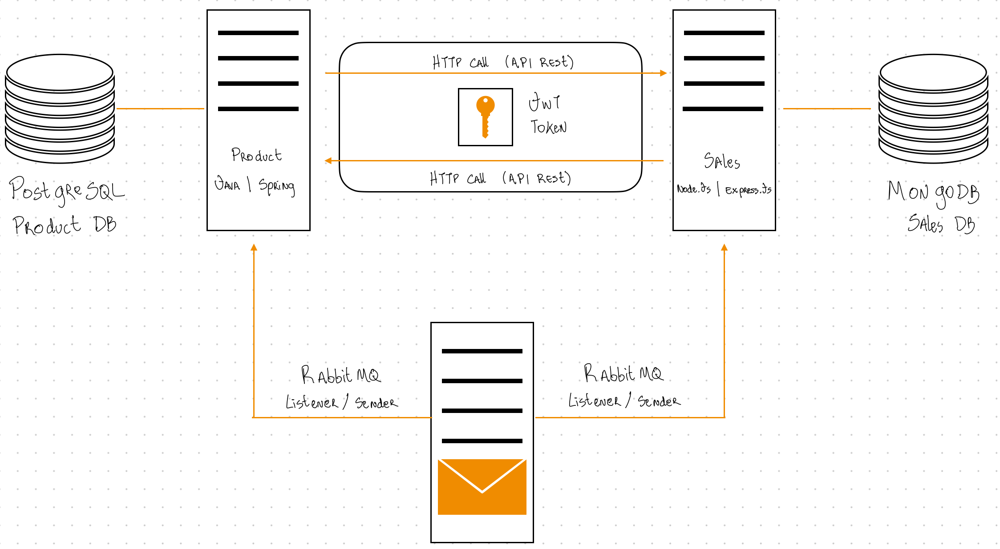
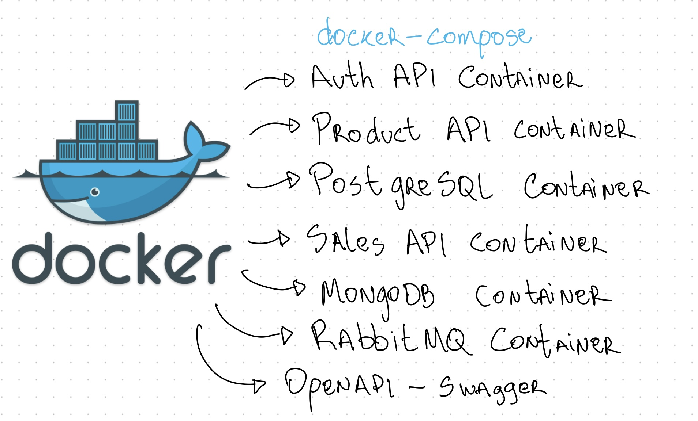

# communication-between-services

under construction 🚧

### ⚡️ Overview

- The construction of this project aims to study communication between services.

### 🚀 Technologies

* Java 11
* Spring Boot 2
* Javascript ES6
* Node.js 14
* ES6 Modules
* Express.js
* MongoDB (Container e Cloud MongoDB)
* API REST
* PostgreSQL (Container)
* RabbitMQ (Container e CloudAMQP)
* Docker
* docker-compose
* JWT
* Spring Cloud OpenFeign
* Axios

### 🛠 Proposed Architecture

We will have 3 micro-services:

**jwt-Auth:** Authentication API with Node.js 14, Express.js, Sequelize, PostgreSQL, JWT and Bcrypt.
**Sales:** Sales API with Node.js 14, Express.js, MongoDB, Mongoose, JWT validation, RabbitMQ and Axios for HTTP clients.
**Product:** Product API with Java 11, Spring Boot, Spring Data JPA, PostgreSQL, JWT validation, RabbitMQ and Spring Cloud OpenFeign for HTTP clients.
We will also have the entire architecture running in docker containers via **docker-compose**.
